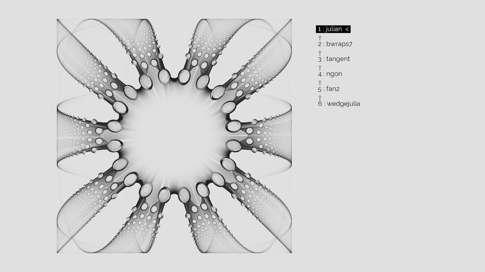
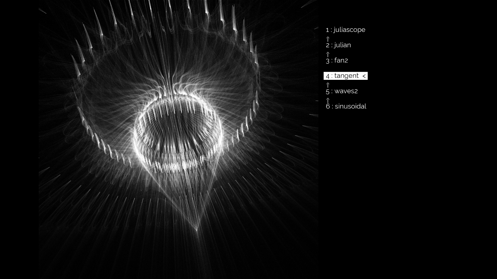

# Variations Combinator

This is a kind of real-time generative art drawing tool coded in openFrameworks and shaders.

The following blog shows images generated with this tool : [https://math-art-variations.tumblr.com/](https://math-art-variations.tumblr.com/)

Examples of outputs :

Screenshot of the tool :

## Linux executable

[**Downloadable on itch.io**](https://bleuje.itch.io/variations-combinator)

Note : functionality to save pictures does not seem to work with the executable yet.

## Building with openFrameworks

[ofxGamepad](https://github.com/Bleuje/ofxGamepad) addon is used (I think you should use my fork because of a fix).

Latest version is tested only on linux so far, but many people have tested it previously on windows before the gamepad functionality was added. Making sure this is useable by other people than me is a work in progress... :)

## Main algorithm

The main algorithm composes a list of functions called *variations* (which I often just call functions here). They take a 2D position as input and return another 2D position (hence they can be composed). By plotting the images of particles filling a 2D square with transparent dots, subtle images can be obtained. The variations used here are found in fractal flames algorithms. Most of them have parameters that can be randomized. This is inspired by work from [Genrateme](https://github.com/genmeblog) aka [tsulej](https://github.com/tsulej) who has also shown his outputs in a tumblr blog : [https://folds2d.tumblr.com/](https://folds2d.tumblr.com/) (see early posts (2016) in its [Archive](https://folds2d.tumblr.com/archive)).

He made a tutorial to explain the algorithm, using Processing : [Folds](https://generateme.wordpress.com/2016/04/11/folds/)

This tool is real-time thanks to [compute shaders](https://github.com/Bleuje/variations-combinator/tree/main/bin/data/shaders).

You can visualize some examples of [variations here](https://www.jwfsanctuary.club/variation-information/variation-guide/) to get an idea. I translated some of them (most of them are not in previous link) from Java into glsl (see [main shader](https://github.com/Bleuje/variations-combinator/blob/main/bin/data/shaders/computeshader_countincrementer.glsl) for source code).

## 3D algorithm

The tool contains a 3D mode : using two 2D -> 2D functions a 4D point cloud can be obtained from the input 2D square. This 4D point cloud is projected into 3D with stereographic projection. This 3D point cloud is then again projected with another stereographic projection to view it on the 2D screen. (Keyboard shortcut for 3D mode : exclamation mark **!**)

## Gamepad

The work on user interface is kind of focused on the use of xbox (maybe playstation too) gamepad, and the openFrameworks addon [ofxGamepad](https://github.com/Bleuje/ofxGamepad) is used. It's the most playful way to discover the tool though there is no save button on gamepad. The gamepad interface is explained on screen when pressing L2.

## Keyboard shortcuts

But it's also controllable with keyboard with more actions, but not in a friendly way and intended for AZERTY keyboard layout.

### Main keyboard shortcuts :

| Key | Description |
| ----------- | ----------- |
| **Escape** | **quit** the app |
| **W** and **X** | function selection navigation / change cursor position |
| **C** and **V** | change function at cursor |
| **S** | **save** picture (with timestamp in filename), also saves the list of functions in a text file. Both in "data/images" folder | 
| **Q** | randomize parameters of function at cursor (not possible for all variations) |
| **Y** | randomize parameters of all functions |
| **Z** | change all functions randomly |
| **F** / **D** | add / remove function above cursor |
| **P** / **O** | add / remove function at the end of the list |
| **N** | change **color** mode |
| **!** (exclamation mark) | activate/deactivate the **3D mode** |
| **E**| change "bounding mode" of drawing |

Less important keyboard shortcuts :

| Key | Description |
| ----------- | ----------- |
| Numpad arrows (**4**,**8**,**6**,**2**) | translate function ar cursor |
| **5** | reset all translations |
| **0** | reset translation of function at cursor |
| **1** and **3** | change scale of function at cursor |
| **.** | reset scale of function at cursor |
| **A** | re-render |
| **)** | screenshot |
| **+** / **-** | more or less opacity per particle |

There are some more, see `void ofApp::keyPressed(int key)` in source code (ofApp.cpp).

## Tricks to get good pictures

Getting interesting results is not really easy the more you become used to the tool. I think that the normal way to explore is to build the main shape from the first functions of the list and gradually work towards texture with the following functions (I mean that the first function of the list is the last function to be applied, and it's the one at the top of the screen). You can also often keep a same function but randomize its parameters. Some variations have very strong character so they become quickly boring as main shape and are better used at an intermediate or texture level.

## License

GNU General Public License v3.0

## Other

Feel free to contribute or share your results.

Thank you generateme for the inspiration.

Possible future work :

- release more executables
- branch without gamepad code
- youtube demo video should come when I'll have my gamepad available
- improve code quality
